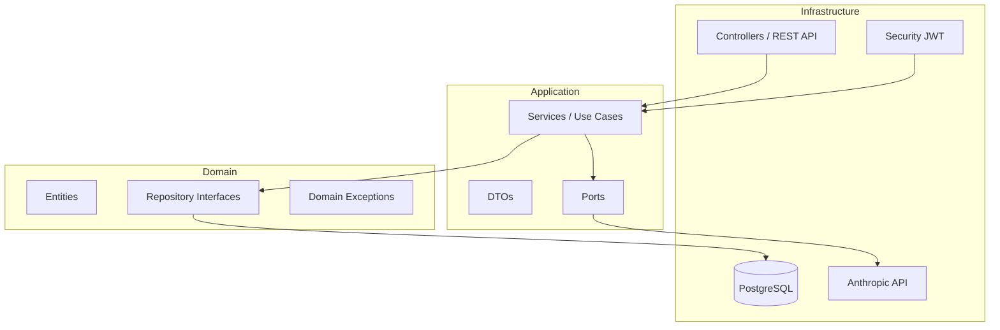
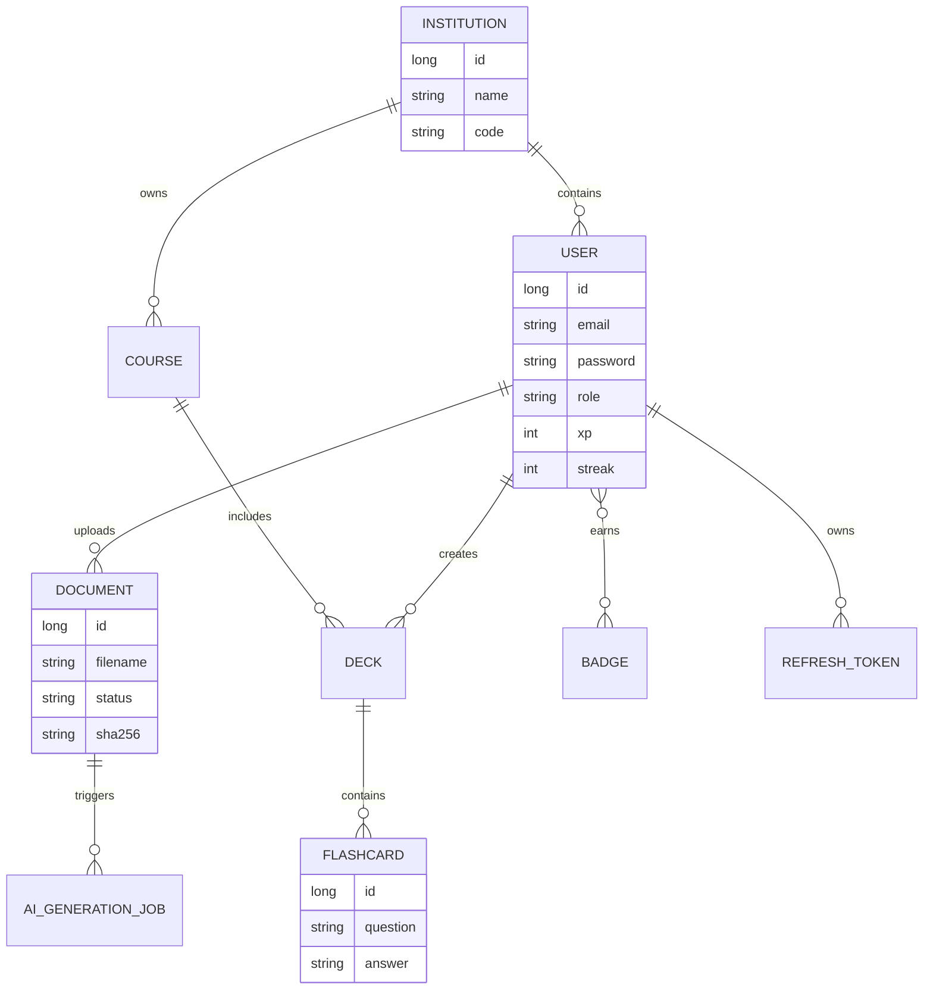
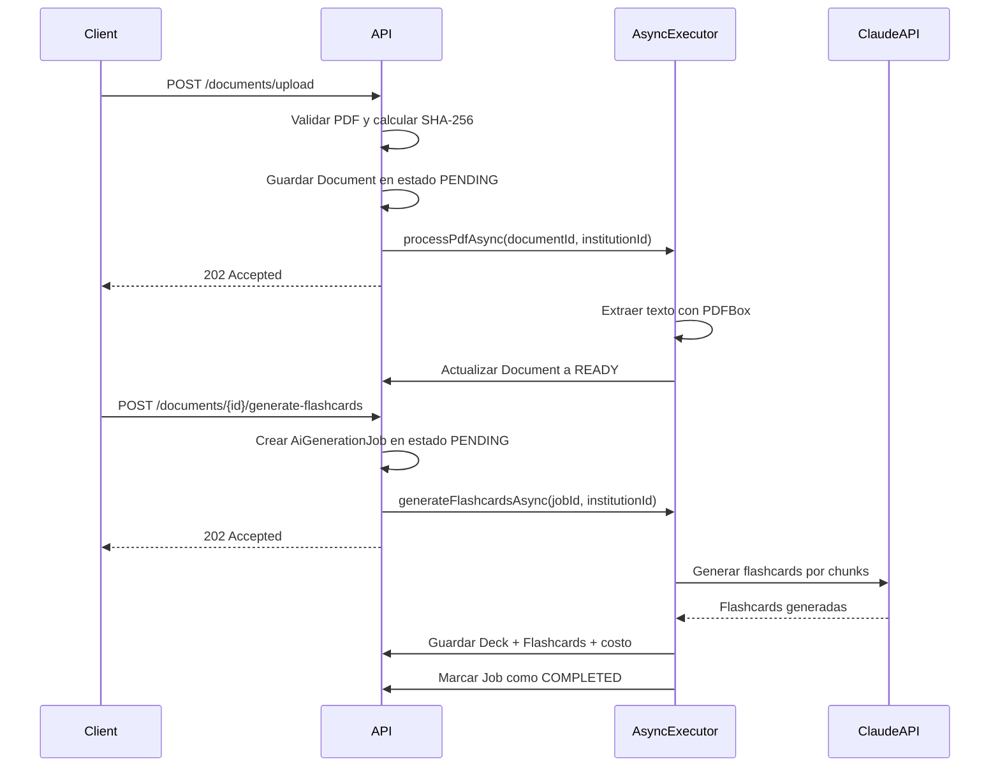

# StreakStudy API

Plataforma de aprendizaje gamificada con IA, construida con Spring Boot 3 y arquitectura hexagonal. Soporta multitenancy a nivel de institución educativa.

[](https://github.com/btoroled/DBP/actions/workflows/ci.yml)

**Curso:** CS 2031 Desarrollo Basado en Plataformas
**Integrantes:** 
* Benjamin Toro Leddihn
* Valentina Celeste Alvarez Beraun
* Daniel Sandoval Toro
* Alexander Leon Pantaleon
* Gloria Alfaro Quispe
---

## Tabla de Contenidos

1. [Introducción](#1-introducción)
2. [Identificación del Problema o Necesidad](#2-identificación-del-problema-o-necesidad)
3. [Descripción de la Solución](#3-descripción-de-la-solución)
4. [Modelo de Entidades](#4-modelo-de-entidades)
5. [Testing y Manejo de Errores](#5-testing-y-manejo-de-errores)
6. [Medidas de Seguridad Implementadas](#6-medidas-de-seguridad-implementadas)
7. [Eventos y Asincronía](#7-eventos-y-asincronía)
8. [GitHub & Management](#8-github--management)
9. [Instalación y Despliegue](#9-instalación-y-despliegue)
10. [Conclusión](#10-conclusión)
11. [Apéndices](#11-apéndices)

---

## 1. Introducción

**Contexto:** En el entorno educativo actual, las instituciones enfrentan el desafío de mantener a los estudiantes comprometidos con sus rutinas de estudio autónomo. Además, la creación de material de repaso estructurado (como flashcards) consume mucho tiempo, lo que desmotiva su uso.

**Objetivos del Proyecto:**
* Desarrollar una API RESTful escalable utilizando Arquitectura Hexagonal.
* Implementar mecánicas de gamificación (rachas, puntos de experiencia y recompensas) para incentivar el estudio diario.
* Automatizar la generación de material de estudio procesando documentos PDF mediante Inteligencia Artificial.
* Garantizar la privacidad de los datos mediante una arquitectura Multi-Tenant estricta a nivel de base de datos.

## 2. Identificación del Problema o Necesidad

**Descripción del Problema:** Los estudiantes universitarios tienden a abandonar los hábitos de estudio progresivo, recurriendo a sesiones intensivas y poco efectivas justo antes de los exámenes. Además, no tienen muchas herramientas que automaticen la creación de recursos de aprendizaje a partir de sus apuntes o sílabos oficiales.

**Justificación:** Es relevante solucionar este problema porque la gamificación ha demostrado aumentar significativamente las tasas de retención de usuarios. Se utiliza la IA generativa para procesar PDFs automáticamente. Hacerlo bajo un modelo Multi-Tenant permite comercializar o distribuir el software a múltiples universidades asegurando que los datos de la "Universidad A" jamás se filtren a la "Universidad B".

## 3. Descripción de la Solución

El backend está diseñado bajo los principios de la **Arquitectura Hexagonal (Ports & Adapters)** para desacoplar la lógica de dominio de las implementaciones técnicas. > [Ver el detalle de la arquitectura y capas internas](docs/architecture.md).



**Funcionalidades Implementadas:**
* **Motor Multi-Tenant:** Aislamiento lógico de usuarios, cursos y documentos por institución educativa.
* **Gamificación:** Sistema de progresión donde los usuarios ganan XP, mantienen rachas diarias (streaks) y compran beneficios (Streak Freezes y Badges) en una tienda virtual.
* **Procesamiento de PDF e IA Generativa:** Endpoint asíncrono que extrae texto de archivos PDF y consulta un LLM para generar automáticamente mazos de flashcards interactivos.
* **API RESTful de Gestión:** CRUD completo para instituciones, cursos, mazos de flashcards y métricas de progreso de los estudiantes.> [Ver la referencia completa de endpoints y payloads JSON](docs/api-reference.md).

**Tecnologías Utilizadas:**
| Componente        | Tecnología                        |
|-------------------|-----------------------------------|
| Lenguaje          | Java 21                           |
| Framework         | Spring Boot 3.4.5                 |
| Persistencia      | Spring Data JPA + PostgreSQL 16   |
| Seguridad         | Spring Security + JWT (JJWT 0.12) |
| IA Generativa     | Anthropic Claude Haiku (REST)     |
| Build y Deploy    | Maven 3.9, Docker + Docker Compose|

## 4. Modelo de Entidades

El dominio se divide en Entidades Globales (como `Institution` y catálogo de `RewardItems`) y Entidades Tenant-Aware (como `User`, `Course`, `Deck` y `Document`). El aislamiento se logra inyectando automáticamente el `institutionId` a través de un `TenantAwareEntityListener` de JPA, impidiendo cruces de información.


> [Ver el catálogo completo de entidades, roles y mecánicas](docs/entities.md).

## 5. Testing y Manejo de Errores

**Niveles de Testing Realizados:**
Se implementaron pruebas unitarias (JUnit 5 + Mockito) para aislar la lógica de negocio (como el cálculo de experiencia y rachas) y pruebas de integración (`@DataJpaTest` + H2/Testcontainers) para verificar las consultas a base de datos y el aislamiento estricto entre tenants.

**Resultados:** La suite de pruebas garantiza que las excepciones de dominio se lancen correctamente y que los flujos asíncronos respondan de manera adecuada.
> [Ver la matriz detallada de cobertura de pruebas](docs/testing.md).

**Manejo de Errores (Excepciones Globales):**
Para garantizar el funcionamiento correcto del sistema y ofrecer mensajes significativos en caso de un error, se centralizó el manejo de errores mediante un `GlobalExceptionHandler` utilizando el patrón `@ControllerAdvice`. Esto aísla la lógica de control de errores de los controladores REST y asegura que las trazas de los *stack traces* internos (que podrían exponer vulnerabilidades) nunca lleguen al cliente.

El sistema hereda de una clase base `DomainException` para estandarizar las validaciones de la capa de aplicación y dominio. Se manejan explícitamente estas excepciones críticas para proteger el modelo multi-tenant y mantener la integridad de los datos.

* **Excepciones de Seguridad y Aislamiento:**
    * `TenantViolationException`: Es la excepción más crítica del sistema. Se lanza inmediatamente si un usuario intenta acceder, modificar o eliminar un recurso (como un curso o documento) cuyo `institutionId` no coincide con el suyo. Manejar esta excepción es vital para prevenir fugas de datos entre diferentes universidades.
    * `InvalidCredentialsException`: Lanzada durante el flujo de autenticación para prevenir el acceso no autorizado sin revelar si el error provino del correo o de la contraseña, mitigando ataques de enumeración de usuarios.

* **Excepciones de Economía y Gamificación:**
  Manejar estas excepciones garantiza que los estudiantes no puedan vulnerar las reglas del sistema ni alterar su progreso de forma fraudulenta:
    * `InsufficientXpException`: Bloquea las transacciones en la tienda virtual si el estudiante intenta adquirir recompensas sin haber completado suficientes sesiones de estudio para acumular la experiencia requerida.
    * `BadgeAlreadyOwnedException`: Previene la compra duplicada de insignias.
    * `MaxStreakFreezesReachedException`: Limita la acumulación excesiva de escudos protectores de racha, obligando al usuario a mantener el hábito de estudio diario en lugar de depender únicamente de los escudos.

* **Excepciones de Integridad de Datos:**
    * `EmailAlreadyExistsException`: Evita colisiones de identidad en la base de datos durante el registro de nuevos usuarios, garantizando la restricción `UNIQUE` del esquema global.
    * `EntityNotFoundException`: Estandariza las respuestas HTTP 404 (Not Found) cuando un cliente solicita identificadores que no existen en su contexto, evitando que la aplicación rompa el flujo o lance excepciones genéricas de base de datos o punteros nulos (`NullPointerException`).

Todos los errores interceptados por el manejador global se transforman y devuelven bajo este formato estandarizado para facilitar el consumo uniforme por parte del frontend:

```json
{
  "timestamp": "2026-05-17T12:00:00Z",
  "status": 404,
  "error": "not_found",
  "message": "Entity not found with id: 99"
}
```
## 6. Medidas de Seguridad Implementadas

**Seguridad de Datos:**
* **Autenticación y Autorización:** Se utiliza Spring Security con tokens JWT (HMAC-SHA256). El `institutionId` viaja encriptado en los claims del token.
* **Cifrado:** Las contraseñas se almacenan mediante hashing con algoritmo BCrypt.
* **Gestión de Permisos:** Se aplican decoradores `@PreAuthorize` granulares en los controladores basados en una matriz estricta de roles (`STUDENT`, `TEACHER`, `INSTITUTION_ADMIN`).

**Prevención de Vulnerabilidades:**
* **Aislamiento de Sesiones:** La API es *stateless*, mitigando riesgos de secuestro de sesión.
* **Rate Limiting y Anti-enumeration:** Los endpoints de recuperación de contraseña responden siempre de manera neutra (202 Accepted) exista o no el correo, y cuentan con un límite de peticiones en memoria para prevenir ataques de fuerza bruta.

---

## 7. Eventos y Asincronía

Para mantener tiempos de respuesta óptimos, la plataforma desacopla los *side-effects* utilizando `ApplicationEvent`.

**Implementación:**
* **Procesamiento de Archivos e IA:** La subida de un PDF responde inmediatamente con un estado `PENDING`. La extracción de texto y las llamadas de red al modelo de IA se ejecutan en un ThreadPool dedicado (`pdfProcessorExecutor`).
* **Notificaciones por Email:** Los correos transaccionales (bienvenida, confirmación de IA) se despachan utilizando listeners `@Async` y `@TransactionalEventListener(AFTER_COMMIT)` para asegurar que el sistema SMTP no ralentice el request original del usuario ni envíe correos si una transacción de base de datos falla.
* **Flujo Asíncrono de Procesamiento de PDF:**


> [Ver la matriz de eventos publicados y listeners](docs/events.md)


---

## 8. GitHub & Management

Para la gestión del proyecto, las tareas se dividieron en *issues* asignados individualmente a los miembros del equipo. Se establecieron *deadlines* semanales y cada ticket fue etiquetado por prioridad y capa técnica (infraestructura, seguridad, endpoints). Para asegurar la calidad del código, se implementó una política de *Pull Requests* (PRs) antes de integrarse a la rama principal.
Se implementó un flujo de Integración Continua (CI) con GitHub Actions. El *workflow* levanta un contenedor de PostgreSQL, compila el proyecto y ejecuta toda la suite de pruebas unitarias y de integración automáticamente en cada Push y Pull Request hacia las ramas principales. Además, se genera un reporte de cobertura automatizado utilizando el plugin JaCoCo.

> [Ver el flujo de trabajo detallado del workflow y variables de CI](docs/ci.md)

---

## 9. Instalación y Despliegue

La plataforma está dockerizada para facilitar el despliegue.

**Quick Start con Docker:**

```bash
cp .env.example .env
# Añadir credenciales (ej. ANTHROPIC_API_KEY) al archivo .env
docker compose up -d --build
```
La API quedará expuesta en `http://localhost:8080`.

**Links del Proyecto:**
* **URL de Producción:** [URL de Render/Railway]
* **Documentación Swagger:** http://localhost:8080/swagger-ui.html
* **Colección Postman:** [Link a JSON en el repo]

---

## 10. Conclusión

**Logros del Proyecto:** Se construyó un backend robusto capaz de gestionar múltiples instituciones educativas de forma hermética. Se logró integrar una mecánica funcional de gamificación y se automatizó con éxito la transformación de material bruto (PDFs) en recursos de estudio interactivos mediante Inteligencia Artificial.

**Aprendizajes Clave:** 
* La aplicación de Arquitectura Hexagonal facilita enormemente la sustitución de adaptadores tecnológicos (por ejemplo, cambiar la herramienta de IA sin alterar el *core*).
* El manejo de asincronía y el control del `ThreadLocal` para propagar el contexto de seguridad (y el Tenant) entre hilos concurrentes representa un desafío importante pero vital para el rendimiento.
* El diseño guiado por eventos (Event-Driven) resulta clave para construir flujos limpios y escalables (como el envío de emails).

**Trabajo Futuro:** 
* Expandir las mecánicas de recompensas con un sistema de ligas o tablas de clasificación (Leaderboard) globales (entre varias instituciones).
* Implementar analíticas descriptivas para que los profesores puedan medir el progreso de sus grupos.

---

## 11. Apéndices

**Licencia:** Código liberado para uso académico bajo los términos del curso.