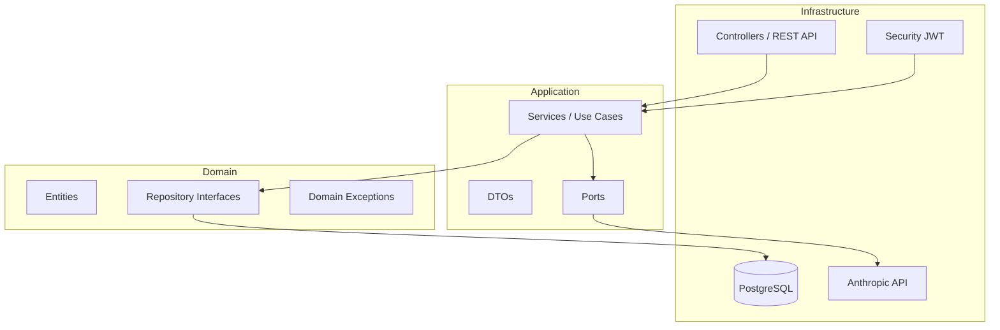
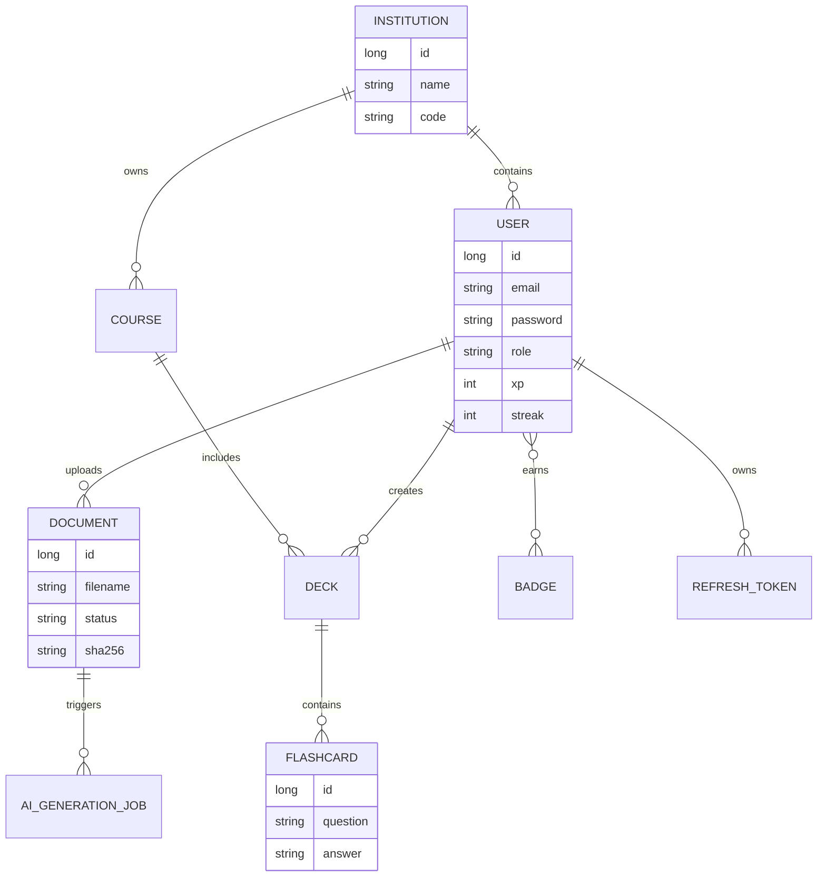
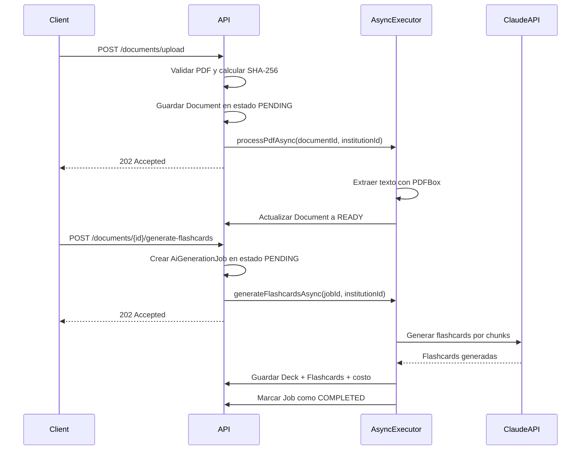

# StreakStudy API

[](https://github.com/btoroled/DBP/actions/workflows/ci.yml)

Plataforma de aprendizaje gamificada con IA, construida con Spring Boot 3 y arquitectura hexagonal. Soporta multitenancy a nivel de institución educativa.

---

## Índice

- [Portada](#portada)
- [Introducción](#introducción)
- [Problema y Necesidad](#problema-y-necesidad)
- [Descripción de la Solución](#descripción-de-la-solución)
- [Modelo de Entidades](#modelo-de-entidades)
- [API REST](#api-rest)
- [Multitenancy](#multitenancy)
- [Medidas de Seguridad Implementadas](#medidas-de-seguridad-implementadas)
- [Eventos y Asincronía](#eventos-y-asincronía)
- [Variables de Entorno](#variables-de-entorno)
- [Instalación y Ejecución](#instalación-y-ejecución)
- [Testing y Manejo de Errores](#testing-y-manejo-de-errores)
- [GitHub & Project Management](#github--project-management)
- [Deployment](#deployment)
- [Conclusiones](#conclusiones)
- [Equipo](#equipo)
- [Referencias](#referencias)
- [Licencia](#licencia)

---

## Portada

- **Título del Proyecto:** StreakStudy API
- **Curso:** CS 2031 Desarrollo Basado en Plataforma
- **Propósito:** plataforma backend para aprendizaje gamificado con IA, multitenancy y automatización de material de estudio
- **Integrantes:**

| Integrante | Código |
|---|---|
| Alfaro Quispe, Gloria | 202310083 |
| Toro Leddihn, Benjamin | 202510596 |
| Leon Pantaleon, Jobeth | 202510035 |
| Alvarez Beraun, Valentina | 202310488 |
| Sandoval Toro, Daniel | 202310533 |

## Introducción

StreakStudy API es el backend de una plataforma educativa gamificada. Cada institución educativa opera como un tenant aislado: sus usuarios, cursos, progreso y documentos no son visibles desde otras organizaciones. La autenticación es por JWT y el contexto de tenant se propaga automáticamente en cada request.

El proyecto surge en un contexto donde los estudiantes consumen contenido académico en PDF, estudian de manera dispersa y no siempre cuentan con mecanismos de seguimiento o refuerzo diario. Al mismo tiempo, las instituciones requieren una solución segura, escalable y trazable para gestionar usuarios, roles, contenido y progreso dentro de límites estrictos de aislamiento de datos.

## Problema y Necesidad

El problema principal es la dificultad de sostener hábitos de estudio dentro de una plataforma multiinstitucional sin comprometer seguridad ni operatividad. Un sistema de este tipo debe resolver necesidades de negocio y de ingeniería al mismo tiempo: autenticación segura, separación por tenant, gestión de permisos, incentivos de uso, procesamiento de documentos y generación de material de práctica.

Sin una solución integrada aparecen varios riesgos: fuga de información entre instituciones, preparación manual y costosa de flashcards, experiencia de estudio fragmentada, poca constancia del alumno y un backend difícil de evolucionar. Por eso el proyecto se enfoca en unificar gamificación, multitenancy e IA en una misma API con arquitectura mantenible.

## Descripción de la Solución

### Arquitectura

El proyecto sigue **Arquitectura Hexagonal (Ports & Adapters)** para desacoplar la lógica de negocio de frameworks y servicios externos.



**Capas principales:**
- **Domain:** entidades y reglas puras, sin dependencia de frameworks.
- **Application:** casos de uso, DTOs y puertos que orquestan la lógica.
- **Infrastructure:** controladores, seguridad, persistencia, jobs y adaptadores externos.

### Decisiones de Diseño

#### Arquitectura Hexagonal

Se eligió arquitectura hexagonal para desacoplar lógica de negocio de frameworks y tecnologías externas. Esto permite cambiar mecanismos de persistencia, autenticación o proveedores de IA sin afectar el dominio principal.

#### Multitenancy basado en ThreadLocal

El uso de TenantContext mediante ThreadLocal permite propagar automáticamente el institutionId durante el ciclo de vida de cada request, asegurando aislamiento entre tenants.

#### Procesamiento Asíncrono

El procesamiento de PDFs y la generación de flashcards se ejecutan de forma asíncrona para evitar bloquear requests HTTP y mejorar escalabilidad.

#### JWT + Refresh Tokens

Se utilizan access tokens de corta duración y refresh tokens para balancear seguridad, continuidad de sesión y control operativo.

### Tecnologías Utilizadas

| Componente        | Tecnología                         |
|-------------------|------------------------------------|
| Lenguaje          | Java 21                            |
| Framework         | Spring Boot 3.4.5                  |
| Persistencia      | Spring Data JPA + PostgreSQL 16    |
| Seguridad         | Spring Security + JWT (JJWT 0.12)  |
| Build             | Maven 3.9                          |
| Contenedores      | Docker + Docker Compose            |
| Tests unitarios   | JUnit 5 + Mockito                  |
| Tests integración | @DataJpaTest + H2 + Testcontainers |
| Extracción PDF    | Apache PDFBox 3.0.3                |
| IA generativa     | Anthropic Claude Haiku (claude-haiku-4-5-20251001) |

### Funcionalidades Implementadas

- **Autenticación y autorización:** registro, login, refresh token, logout y recuperación de contraseña.
- **Multitenancy por institución:** el backend aísla usuarios, cursos, decks y progreso por institutionId.
- **Gamificación:** XP, rachas, streak freezes y compra de badges.
- **Gestión académica:** instituciones, cursos, decks y flashcards.
- **Procesamiento documental:** carga de PDF, deduplicación por hash y extracción de texto.
- **Generación de estudio con IA:** creación automática de flashcards a partir de PDFs.
- **Observabilidad y operación:** health checks, OpenAPI/Swagger y CI automatizada.

### Estructura del Proyecto

```
src/main/java/com/streakstudy/
|-- StreakStudyApplication.java
|-- domain/
|   |-- model/
|   |   |-- User.java
|   |   |-- Course.java
|   |   |-- Institution.java
|   |   |-- Badge.java
|   |   |-- RewardItem.java
|   |   |-- Document.java
|   |   |-- DocumentStatus.java
|   |   |-- AiGenerationJob.java
|   |   |-- AiGenerationJobStatus.java
|   |   |-- Deck.java
|   |   |-- Flashcard.java
|   |   |-- UserRole.java
|   |   `-- TenantAware.java
|   |-- repository/
|   |   |-- UserRepository.java
|   |   |-- CourseRepository.java
|   |   |-- InstitutionRepository.java
|   |   |-- RewardItemRepository.java
|   |   |-- DocumentRepository.java
|   |   |-- AiGenerationJobRepository.java
|   |   |-- DeckRepository.java
|   |   `-- FlashcardRepository.java
|   `-- exception/
|       |-- DomainException.java
|       |-- BadgeAlreadyOwnedException.java
|       |-- EmailAlreadyExistsException.java
|       |-- EntityNotFoundException.java
|       |-- InsufficientXpException.java
|       |-- InvalidCredentialsException.java
|       |-- MaxStreakFreezesReachedException.java
|       `-- TenantViolationException.java
|-- application/
|   |-- dto/
|   |-- service/
|   |   |-- AuthService.java
|   |   |-- CourseService.java
|   |   |-- DeckService.java
|   |   |-- DocumentService.java
|   |   |-- DocumentProcessingService.java
|   |   |-- FlashcardService.java
|   |   |-- InstitutionService.java
|   |   |-- LeaderboardService.java
|   |   |-- RewardItemService.java
|   |   |-- StoreService.java
|   |   |-- StreakResetService.java
|   |   `-- UserProgressService.java
|   `-- port/
|       |-- DocumentProcessingPort.java
|       |-- PdfTextExtractorPort.java
|       |-- AiFlashcardGeneratorPort.java
|       |-- FinishReviewUseCase.java
|       |-- GetUserProgressUseCase.java
|       |-- PasswordHasher.java
|       `-- TokenIssuer.java
`-- infrastructure/
    |-- ai/
    |   |-- PdfBoxTextExtractorAdapter.java
    |   `-- AnthropicFlashcardGeneratorAdapter.java
    |-- config/
    |   `-- AsyncConfig.java
    |-- job/
    |-- persistence/
    |-- security/
    |-- tenancy/
    `-- web/
```

---

## Modelo de Entidades



### Descripción de Entidades

| Entidad            | Tenant-Aware | Descripción                                              |
|--------------------|:------------:|----------------------------------------------------------|
| `Institution`      | No (raíz)    | Institución educativa (`code`: "utec", "pucp")           |
| `User`             | Sí           | Usuario con XP, racha diaria y badges                    |
| `Course`           | Sí           | Curso perteneciente a una institución                    |
| `Badge`            | No           | Insignia comprable con XP                                |
| `RewardItem`       | No           | Item del catálogo de la tienda                           |
| `Document`         | Sí           | PDF subido; pasa por estados PENDING -> PROCESSING -> READY |
| `AiGenerationJob`  | No           | Registro de un trabajo de generación IA con tracking de tokens y costo |
| `Deck`             | Sí           | Mazo de flashcards                                       |
| `Flashcard`        | Sí           | Pregunta + respuesta generada por IA                     |

### Roles de Usuario

| Rol                  | Descripción                            |
|----------------------|----------------------------------------|
| `STUDENT`            | Alumno dentro de una institución       |
| `TEACHER`            | Facilitador dentro de una institución  |
| `INSTITUTION_ADMIN`  | Administrador de la institución        |
| `SUPER_ADMIN`        | Administrador cross-tenant             |

### Mecánicas de Gamificación

- **XP:** Los estudiantes ganan XP al completar revisiones (`POST /api/users/me/progress/review`).
- **Racha:** Días consecutivos con al menos una revisión completada. Un job diario reinicia la racha de estudiantes inactivos.
- **Streak Freeze:** Item comprable que protege la racha ante un día sin actividad.
- **Badges:** Insignias comprables con XP en la tienda.

---

## Eventos y Asincronía

### Flujo Asíncrono de Procesamiento PDF

El pipeline está completamente desacoplado del request HTTP: la API valida y registra el documento, responde `202 Accepted`, y luego deriva el procesamiento pesado a un ejecutor asíncrono dedicado.



### Deduplicación de Documentos

Cada PDF subido se identifica por su hash SHA-256. Si un archivo idéntico ya existe, el endpoint devuelve el documento existente con `"duplicate": true` sin reprocesar.

### Tracking de Costos

Cada `AiGenerationJob` registra:
- `totalInputTokens` / `totalOutputTokens` acumulados sobre todos los chunks
- `estimatedCostUsd` calculado con los precios de Haiku: $0.80/M input · $4.00/M output

### Propagación del Tenant en Threads Async

Como los threads del pool no heredan el `ThreadLocal` del hilo HTTP, los métodos de `DocumentProcessingService` reciben `institutionId` como parámetro explícito y llaman a `TenantContext.set(institutionId)` al inicio, liberándolo en un bloque `finally`.

---

## API REST

### Autenticación (`/api/auth`) - Pública

| Método | Endpoint              | Descripción                     |
|--------|-----------------------|---------------------------------|
| POST   | `/api/auth/register`  | Registrar nuevo usuario         |
| POST   | `/api/auth/login`     | Iniciar sesión, obtener JWT     |

**Registro:**
```json
POST /api/auth/register
{
  "institutionId": 1,
  "email": "alumno@utec.edu.pe",
  "password": "12345678",
  "fullName": "Juan Pérez"
}
```

**Login:**
```json
POST /api/auth/login
{
  "email": "alumno@utec.edu.pe",
  "password": "12345678"
}
```

**Respuesta JWT:**
```json
{
  "token": "eyJ...",
  "expiresInSeconds": 3600,
  "userId": 1,
  "institutionId": 1,
  "email": "alumno@utec.edu.pe",
  "role": "STUDENT"
}
```

**Refresh tokens (nuevo flujo):**
```json
POST /api/v1/auth/login
{
  "accessToken": "eyJ...",
  "refreshToken": "0b9f...c7a",
  "expiresIn": 900,
  "userId": 1,
  "institutionId": 1,
  "email": "alumno@utec.edu.pe",
  "role": "STUDENT",
  "xp": 0
}
```

```json
POST /api/v1/auth/refresh
{
  "refreshToken": "0b9f...c7a"
}
```

```json
POST /api/v1/auth/logout
Authorization: Bearer <accessToken>
{
  "refreshToken": "0b9f...c7a"
}
```

**Recuperación de contraseña (Issue #10):**

| Método | Endpoint                          | Descripción                                 |
|--------|-----------------------------------|---------------------------------------------|
| POST   | `/api/v1/auth/password/forgot`    | Solicita email con link de reset -> 202     |
| POST   | `/api/v1/auth/password/reset`     | Confirma reset con token -> 204             |

```json
POST /api/v1/auth/password/forgot
{
  "email": "alumno@utec.edu.pe"
}
```
**Respuesta:** `202 Accepted` siempre - existe o no el email (anti-enumeration). Si el correo está habilitado (`MAIL_ENABLED=true`), se envía el link a `${FRONTEND_URL}/reset-password?token=...`.

```json
POST /api/v1/auth/password/reset
{
  "token": "<token-del-email>",
  "newPassword": "MiNuevaPassword123"
}
```
**Respuesta:** `204 No Content` cuando el token es válido.
**Errores:** `400 invalid_password_reset_token` si no existe o ya fue usado · `410 password_reset_token_expired` si pasó el TTL (30 min por defecto).

Características de seguridad:
- Token de **un solo uso**: tras un reset exitoso, el token se marca como usado.
- **Rotación**: solicitar un nuevo `/forgot` invalida todos los tokens previos activos del mismo email.
- Solo se almacena el **SHA-256** del token en `password_reset_tokens.token_hash`; el plaintext nunca toca la BD ni los logs.
- **Rate limit** in-memory: 5 requests/email/hora a `/forgot` (configurable). Excedido -> `429 Too Many Requests`.

---

### Documentos PDF y Flashcards IA (`/api/documents`) - Requiere JWT

| Método | Endpoint                              | Descripción                                              |
|--------|---------------------------------------|----------------------------------------------------------|
| POST   | `/api/documents/upload`               | Subir PDF (multipart/form-data) -> 202 Accepted          |
| GET    | `/api/documents/{id}/status`          | Consultar estado de procesamiento del documento          |
| GET    | `/api/documents/{id}/markdown`        | Obtener texto extraído del PDF (solo si READY)           |
| POST   | `/api/documents/{id}/generate-flashcards` | Disparar generación IA -> 202 Accepted con jobId      |
| GET    | `/api/documents/jobs/{jobId}`         | Consultar estado del job IA (tokens, costo)              |
| GET    | `/api/documents/{id}/flashcards`      | Obtener las flashcards generadas para el documento       |

**Subir PDF:**
```
POST /api/documents/upload
Authorization: Bearer <jwt>
Content-Type: multipart/form-data

file=@apuntes.pdf
```

**Respuesta upload:**
```json
{
  "documentId": 42,
  "originalFilename": "apuntes.pdf",
  "status": "PENDING",
  "duplicate": false
}
```

**Estado del documento:**
```json
GET /api/documents/42/status

{
  "documentId": 42,
  "originalFilename": "apuntes.pdf",
  "status": "READY",
  "markdownAvailable": true
}
```

**Generar flashcards:**
```json
POST /api/documents/42/generate-flashcards
Authorization: Bearer <jwt>

{
  "deckId": 7
}
```

**Respuesta generación:**
```json
{
  "jobId": 77,
  "documentId": 42,
  "deckId": 7,
  "status": "PENDING",
  "totalInputTokens": 0,
  "totalOutputTokens": 0,
  "estimatedCostUsd": 0.0,
  "errorMessage": null
}
```

**Estado del job (finalizado):**
```json
GET /api/documents/jobs/77

{
  "jobId": 77,
  "documentId": 42,
  "deckId": 7,
  "status": "COMPLETED",
  "totalInputTokens": 1200,
  "totalOutputTokens": 480,
  "estimatedCostUsd": 0.00288,
  "errorMessage": null
}
```

---

### Mazos de Flashcards (`/api/decks`) - Requiere JWT

| Método | Endpoint           | Descripción                                  |
|--------|--------------------|----------------------------------------------|
| POST   | `/api/decks`       | Crear mazo (tenant actual)                   |
| GET    | `/api/decks`       | Listar mazos del tenant actual               |
| GET    | `/api/decks/{id}`  | Obtener mazo por ID (solo tenant actual)     |
| PUT    | `/api/decks/{id}`  | Actualizar nombre/descripción del mazo       |
| DELETE | `/api/decks/{id}`  | Eliminar mazo (solo tenant actual)           |

**Crear mazo:**
```json
POST /api/decks
Authorization: Bearer <jwt>

{
  "name": "Cálculo I - Derivadas",
  "description": "Mazo de práctica para el primer parcial"
}
```

**Respuesta:**
```json
{
  "id": 7,
  "institutionId": 1,
  "name": "Cálculo I - Derivadas",
  "description": "Mazo de práctica para el primer parcial",
  "createdAt": "2026-05-23T14:35:00Z"
}
```

**Actualizar mazo:**
```json
PUT /api/decks/7
Authorization: Bearer <jwt>

{
  "name": "Cálculo I - Derivadas e Integrales",
  "description": "Mazo de práctica para parciales 1 y 2"
}
```

---

### Flashcards (`/api/flashcards`) - Requiere JWT

| Método | Endpoint                          | Descripción                              |
|--------|-----------------------------------|------------------------------------------|
| POST   | `/api/flashcards`                 | Crear flashcard manualmente              |
| GET    | `/api/flashcards/deck/{deckId}`   | Listar flashcards de un mazo             |
| GET    | `/api/flashcards/{id}`            | Obtener flashcard por ID                 |
| PUT    | `/api/flashcards/{id}`            | Actualizar pregunta/respuesta            |
| DELETE | `/api/flashcards/{id}`            | Eliminar flashcard                       |

**Crear flashcard:**
```json
POST /api/flashcards
Authorization: Bearer <jwt>

{
  "deckId": 7,
  "question": "¿Cuál es la derivada de sin(x)?",
  "answer": "cos(x)"
}
```

**Respuesta:**
```json
{
  "id": 101,
  "deckId": 7,
  "question": "¿Cuál es la derivada de sin(x)?",
  "answer": "cos(x)",
  "createdAt": "2026-05-23T14:40:00Z"
}
```

**Actualizar flashcard:**
```json
PUT /api/flashcards/101
Authorization: Bearer <jwt>

{
  "question": "¿Cuál es la derivada de sen(x)?",
  "answer": "cos(x)"
}
```

---

### Cursos (`/api/courses`) - Requiere JWT

| Método | Endpoint            | Descripción                               |
|--------|---------------------|-------------------------------------------|
| POST   | `/api/courses`      | Crear curso (tenant actual)               |
| GET    | `/api/courses`      | Listar cursos del tenant actual           |
| GET    | `/api/courses/{id}` | Obtener curso por ID (solo tenant actual) |
| DELETE | `/api/courses/{id}` | Eliminar curso (solo tenant actual)       |

**Crear curso:**
```json
POST /api/courses
Authorization: Bearer <jwt>

{
  "name": "Cálculo I",
  "description": "Límites, derivadas e integrales"
}
```

---

### Instituciones (`/api/institutions`) - Pública

| Método | Endpoint                  | Descripción              |
|--------|---------------------------|--------------------------|
| POST   | `/api/institutions`       | Crear institución        |
| GET    | `/api/institutions/{id}`  | Obtener institución      |

**Crear institución:**
```json
POST /api/institutions
{
  "name": "Universidad de Ingeniería y Tecnología",
  "code": "utec"
}
```

---

### Progreso del Usuario (`/api/users/me/progress`) - Requiere JWT

| Método | Endpoint                           | Descripción                                      |
|--------|------------------------------------|--------------------------------------------------|
| GET    | `/api/users/me/progress`           | Obtener XP, racha y badges del usuario actual   |
| POST   | `/api/users/me/progress/review`    | Registrar finalización de una revisión (STUDENT) |

**Registrar revisión:**
```json
POST /api/users/me/progress/review
Authorization: Bearer <jwt>

{
  "courseId": 1,
  "xpEarned": 50
}
```

**Respuesta de progreso:**
```json
{
  "userId": 1,
  "xp": 350,
  "streak": 5,
  "streakFreezes": 1,
  "badges": ["FLAME", "SCHOLAR"]
}
```

---

### Tienda (`/api/store`) - Requiere JWT

| Método | Endpoint                  | Descripción                              |
|--------|---------------------------|------------------------------------------|
| POST   | `/api/store/streak-freeze` | Comprar un streak freeze con XP          |
| POST   | `/api/store/badges`        | Comprar un badge con XP (STUDENT)        |

**Comprar badge:**
```json
POST /api/store/badges
Authorization: Bearer <jwt>

{
  "badgeName": "FLAME"
}
```

---

### Catálogo de Recompensas (`/api/rewards`) - Requiere JWT

| Método | Endpoint       | Descripción                           |
|--------|----------------|---------------------------------------|
| GET    | `/api/rewards` | Listar todos los items de la tienda   |

---

### Leaderboard (`/api/leaderboard`) - Requiere JWT

| Método | Endpoint            | Descripción                                                      |
|--------|---------------------|------------------------------------------------------------------|
| GET    | `/api/leaderboard`  | Ranking de estudiantes del tenant actual, ordenado por XP desc  |

**Respuesta:**
```json
[
  { "id": 3, "fullName": "Ana García",  "streak": 12, "points": 850 },
  { "id": 1, "fullName": "Juan Pérez",  "streak": 5,  "points": 350 },
  { "id": 7, "fullName": "Luis Torres", "streak": 2,  "points": 200 }
]
```

---

### Salud (`/api/health`) - Pública

| Método | Endpoint       | Descripción      |
|--------|----------------|------------------|
| GET    | `/api/health`  | Estado de la API |

---

### Códigos de Error Estandarizados

Todos los errores siguen este formato:

```json
{
  "timestamp": "2026-05-17T12:00:00Z",
  "status": 404,
  "error": "not_found",
  "message": "Entity not found with id: 99"
}
```

| Código HTTP | `error`                            | Causa                             |
|-------------|------------------------------------|-----------------------------------|
| 400         | `validation_error`                 | Campos inválidos (con `errors[]`) |
| 400         | `bad_request`                      | Argumento inválido                |
| 401         | `invalid_credentials`              | Email o contraseña incorrectos    |
| 402         | `insufficient_xp`                  | XP insuficiente para comprar      |
| 403         | `tenant_violation`                 | Acceso a datos de otro tenant     |
| 404         | `not_found`                        | Recurso no encontrado             |
| 409         | `email_already_exists`             | Email ya registrado               |
| 409         | `institution_code_already_exists`  | Código de institución duplicado   |
| 409         | `badge_already_owned`              | El usuario ya posee ese badge     |
| 409         | `max_streak_freezes_reached`       | Límite de streak freezes alcanzado|

---

## Multitenancy

El aislamiento entre tenants se implementa en múltiples capas:

1. **JWT:** El token lleva el claim `institutionId` del usuario autenticado.
2. **TenantContext:** Al iniciar cada request, `JwtAuthenticationFilter` extrae el `institutionId` del JWT y lo almacena en un `ThreadLocal`. Se limpia al finalizar el request.
3. **Services:** Todos los métodos de servicios tenant-aware llaman a `TenantContext.requireInstitutionId()` antes de ejecutar.
4. **Queries JPA:** Todas las consultas de entidades tenant-aware incluyen `institutionId` como parámetro explícito.
5. **JPA Listener:** `TenantAwareEntityListener` valida en `@PrePersist` y `@PreUpdate` que el `institution_id` de la entidad coincide con el contexto actual. Si hay mismatch, lanza `TenantViolationException`.
6. **Threads async:** Los métodos de `DocumentProcessingService` reciben `institutionId` explícitamente y establecen el `TenantContext` en el thread del pool.

El resultado: si el tenant A intenta acceder a datos del tenant B, recibe `404` (para no filtrar la existencia del recurso) o `403`.

---

## Medidas de Seguridad Implementadas

- **Algoritmo JWT:** HS256 con secreto configurable (mínimo 32 caracteres).
- **Expiración del token:** 1 hora por defecto (configurable con `JWT_EXPIRATION_MS`).
- **Contraseñas:** Hasheadas con BCrypt.
- **API Stateless:** Sin sesiones, CSRF deshabilitado.
- **Contexto de seguridad:** `AuthenticatedUserPrincipal` almacenado en el `SecurityContext`; no se realizan consultas adicionales a la BD por request.

### Roles y Permisos (Issue #7)

Roles definidos en `UserRole`: `STUDENT`, `TEACHER`, `INSTITUTION_ADMIN`, `SUPER_ADMIN`.

Matriz de autorización aplicada con `@PreAuthorize` granular (controller + método):

| Endpoint                                       | Roles permitidos                                       |
|------------------------------------------------|--------------------------------------------------------|
| `POST /api/v1/auth/**`                         | público (register, login, refresh, forgot, reset)      |
| `POST /api/v1/auth/logout`                     | autenticado                                            |
| `POST /api/v1/institutions`                    | público (TODO: restringir a `SUPER_ADMIN` con seed)    |
| `GET  /api/v1/institutions/{id}`               | público                                                |
| `POST /api/v1/courses`                         | `TEACHER`, `INSTITUTION_ADMIN`, `SUPER_ADMIN`          |
| `GET  /api/v1/courses[/{id}]`                  | autenticado                                            |
| `DELETE /api/v1/courses/{id}`                  | `INSTITUTION_ADMIN`, `SUPER_ADMIN`                     |
| `POST /api/v1/decks`, `PUT/DELETE /decks/{id}` | `STUDENT`, `TEACHER`, `INSTITUTION_ADMIN`, `SUPER_ADMIN` |
| `GET  /api/v1/decks[/{id}]`                    | autenticado                                            |
| `POST/PUT/DELETE /api/v1/flashcards/**`        | `STUDENT`, `TEACHER`, `INSTITUTION_ADMIN`, `SUPER_ADMIN` |
| `GET  /api/v1/flashcards/**`                   | autenticado                                            |
| `POST /api/v1/store/streak-freeze`             | `STUDENT`                                              |
| `POST /api/v1/store/badges`                    | `STUDENT`                                              |
| `POST /api/v1/users/me/progress/review`        | `STUDENT`                                              |
| `GET  /api/v1/users/me/progress`               | autenticado                                            |
| `POST /api/v1/documents/**`, `GET /api/v1/documents/**` | autenticado                                   |
| `GET  /api/v1/rewards`                         | autenticado                                            |

Acceso sin la autoridad correcta -> `403 forbidden` (mapeado por `GlobalExceptionHandler` desde `AccessDeniedException`).

---

### Eventos de Dominio y Email

StreakStudy desacopla los side-effects de la lógica de negocio publicando
`ApplicationEvent`s desde los servicios y consumiéndolos en listeners
asíncronos. El correo transaccional se envía en plantillas Thymeleaf desde
un thread pool dedicado (`emailExecutor`, 2-4 hilos).

### Eventos publicados

| Evento                       | Publicado por                                         | Trigger                                       |
|------------------------------|-------------------------------------------------------|-----------------------------------------------|
| `UserRegisteredEvent`        | `AuthService.register`                                | Registro exitoso (commit de transacción)      |
| `FlashcardsGeneratedEvent`   | `DocumentProcessingService.generateFlashcards`        | Job de IA completado                          |
| `BadgeEarnedEvent`           | `StoreService.buyBadge`                               | Compra de badge exitosa (commit de transacción) |

Los eventos son `record`s **self-contained**: cargan todos los datos que el
listener necesita (email, fullName, deckId, etc.) para que el listener no
tenga que consultar repositorios. Esto evita problemas con `TenantContext`
en threads asíncronos.

### Listeners de email

| Listener                          | Plantilla                       | Estrategia                                                   |
|-----------------------------------|---------------------------------|--------------------------------------------------------------|
| `WelcomeEmailListener`            | `welcome.html`                  | `@TransactionalEventListener(AFTER_COMMIT)` + `@Async`        |
| `FlashcardsReadyEmailListener`    | `flashcards-ready.html`         | `@EventListener` + `@Async` (corre tras job async)            |
| `BadgeEarnedEmailListener`        | `badge-earned.html`             | `@TransactionalEventListener(AFTER_COMMIT)` + `@Async`        |

`AFTER_COMMIT` garantiza que, si la transacción que publicó el evento hace
rollback (p.ej. email duplicado detectado por una unique constraint), el
correo nunca se envía. El thread pool `email-*` desacopla el envío del
request HTTP original.

### Modo `MAIL_ENABLED=false`

Por defecto la app arranca con `app.mail.enabled=false`: el adapter loguea
`[MAIL-DISABLED] to=... subject=...` sin contactar al servidor SMTP. Útil
para desarrollo local, CI y tests. Para enviar correo real:

```bash
MAIL_ENABLED=true \
MAIL_HOST=smtp.gmail.com \
MAIL_PORT=587 \
MAIL_USER=tu-cuenta@gmail.com \
MAIL_PASSWORD=tu-app-password \
MAIL_FROM=no-reply@streakstudy.com \
./mvnw spring-boot:run
```

Si el envío SMTP falla, el adapter loguea ERROR pero **no propaga la
excepción**: el flujo de negocio del request original no se rompe.

### Plantillas Thymeleaf

Ubicadas en `src/main/resources/templates/email/`:

- `welcome.html` - Bienvenida al registrarse
- `flashcards-ready.html` - Notificación de flashcards generadas
- `badge-earned.html` - Notificación de badge desbloqueado

### Tests de Email y Eventos

| Test                                  | Tipo            | Verifica                                                    |
|---------------------------------------|-----------------|-------------------------------------------------------------|
| `EmailTemplateRendererTest`           | Unitario        | Renderizado de las 3 plantillas con datos de muestra        |
| `JavaMailEmailSenderAdapterTest`      | Unitario        | `MAIL_ENABLED=false` skip SMTP; errores no se propagan      |
| `WelcomeEmailListenerTest`            | Unitario        | El listener llama `sendHtml` con asunto y modelo correctos  |
| `AuthServiceEventTest`                | Event           | `register()` publica `UserRegisteredEvent`; no publica si rollback |
| `StoreServiceEventTest`               | Event           | `buyBadge()` publica `BadgeEarnedEvent`; no publica si excepción de dominio |
| `EmailIntegrationTest`                | Integración     | GreenMail SMTP real recibe el MIME message renderizado      |

---

## Variables de Entorno

Copiar `.env.example` a `.env` y completar los valores:

| Variable             | Default                                           | Descripción                              |
|----------------------|---------------------------------------------------|------------------------------------------|
| `SERVER_PORT`        | `8080`                                            | Puerto del servidor                      |
| `DB_URL`             | `jdbc:postgresql://localhost:5432/streakstudy_db` | URL de base de datos                     |
| `DB_USER`            | `postgres`                                        | Usuario de BD                            |
| `DB_PASSWORD`        | `postgres`                                        | Contraseña de BD                         |
| `DB_POOL_MAX`        | `10`                                              | Máximo de conexiones (HikariCP)          |
| `DB_POOL_MIN`        | `2`                                               | Mínimo de conexiones idle                |
| `JPA_DDL`            | `update`                                          | DDL auto: `update`, `validate`, `none`   |
| `JPA_SHOW_SQL`       | `true`                                            | Loguear SQL en consola                   |
| `JWT_SECRET`         | *(inseguro por defecto)*                          | **Cambiar en producción** (min 32 chars) |
| `JWT_EXPIRATION_MS`  | `3600000`                                         | Expiración JWT en milisegundos (1h)      |
| `ANTHROPIC_API_KEY`  | *(requerido para IA)*                             | API key de Anthropic para Claude Haiku   |
| `MAIL_ENABLED`       | `false`                                           | Habilita envío SMTP real (ver [Eventos y Asincronía](#eventos-y-asincronía)) |
| `MAIL_HOST`          | `smtp.gmail.com`                                  | Servidor SMTP                            |
| `MAIL_PORT`          | `587`                                             | Puerto SMTP                              |
| `MAIL_USER`          | *(vacío)*                                         | Usuario SMTP                             |
| `MAIL_PASSWORD`      | *(vacío)*                                         | Contraseña / app password SMTP           |
| `MAIL_FROM`          | `no-reply@streakstudy.com`                        | Dirección remitente                      |
| `PASSWORD_RESET_TTL_MIN`         | `30`     | TTL del token de reset (minutos)         |
| `FRONTEND_URL`                   | `http://localhost:5173` | Base URL del frontend para el link del email |
| `PASSWORD_RESET_RATE_LIMIT_MAX`  | `5`      | Max requests a `/forgot` por email en la ventana |
| `PASSWORD_RESET_RATE_LIMIT_WINDOW_MIN` | `60` | Ventana del rate limit (minutos)         |

---

## Instalación y Ejecución

### Ejecución con Docker

```bash
# Copiar variables de entorno
cp .env.example .env
# Editar .env y agregar ANTHROPIC_API_KEY

# Levantar PostgreSQL + API
docker compose up -d --build

# Ver logs
docker compose logs -f api

# Bajar el stack
docker compose down
```

La API queda disponible en `http://localhost:8080`.

**Smoke test básico:**
```bash
bash scripts/smoke-test.sh
```

**Smoke test multitenancy:**
```bash
bash scripts/multitenancy-smoke-test.sh
```

---

### Ejecución Local

Requiere Java 21 y PostgreSQL corriendo localmente.

```bash
# Compilar
./mvnw clean package -DskipTests

# Ejecutar
DB_URL=jdbc:postgresql://localhost:5432/streakstudy_db \
DB_USER=postgres \
DB_PASSWORD=postgres \
JWT_SECRET=mi-secreto-de-al-menos-32-caracteres-aqui \
ANTHROPIC_API_KEY=sk-ant-... \
./mvnw spring-boot:run
```

### Probar rápido en Swagger

Con la app levantada, abre:

- `http://localhost:8080/swagger-ui.html`
- `http://localhost:8080/v3/api-docs`

Orden recomendado para validar el flujo completo:

1. `POST /api/v1/institutions`

```json
{
  "name": "UTEC Demo",
  "code": "utec-demo"
}
```

Guarda el `id` de la institución creada.

2. `POST /api/v1/auth/register`

```json
{
  "institutionId": 1,
  "email": "alumno@demo.com",
  "password": "12345678",
  "fullName": "Juan Perez"
}
```

Reemplaza `institutionId` por el `id` real del paso 1.

3. `POST /api/v1/auth/login`

```json
{
  "email": "alumno@demo.com",
  "password": "12345678"
}
```

Copia el `accessToken` de la respuesta.

4. Pulsa `Authorize` y pega:

```text
Bearer <accessToken>
```

5. Prueba endpoints protegidos como:

- `GET /api/v1/users/me/progress`
- `GET /api/v1/rewards`
- `POST /api/v1/auth/logout`

Si un endpoint protegido devuelve `403`, normalmente falta autorizar con el JWT o el rol del usuario no tiene permiso para esa operación.

---

## Testing y Manejo de Errores

```bash
# Ejecutar todos los tests
./mvnw test
```

### Manejo de Errores

El proyecto utiliza @RestControllerAdvice para centralizar respuestas de error y devolver estructuras consistentes con código HTTP, mensaje, timestamp y path. Se manejan excepciones de validación, credenciales inválidas, access denied, entidades no encontradas, refresh tokens expirados o revocados y violaciones de tenant.

### Cobertura de Tests

| Test                                    | Tipo           | Qué verifica                                        |
|-----------------------------------------|----------------|-----------------------------------------------------|
| `AuthServiceTest`                       | Unitario       | Registro, login, manejo de errores                  |
| `CourseServiceTest`                     | Unitario       | CRUD de cursos con tenant mock                      |
| `CourseServicePostgresContainerTest`    | Integración    | CRUD de cursos contra PostgreSQL real               |
| `InstitutionServiceTest`                | Unitario       | Creación de instituciones, código duplicado         |
| `LeaderboardServiceTest`                | Unitario       | Ranking filtrado por tenant                         |
| `RewardItemServiceTest`                 | Unitario       | Catálogo de items de la tienda                      |
| `StoreServiceTest`                      | Unitario       | Compra de streak freezes y badges, validaciones XP  |
| `StreakResetServiceTest`                | Unitario       | Reset de rachas de usuarios inactivos               |
| `UserProgressServiceTest`               | Unitario       | Registro de revisiones, acumulación de XP y racha   |
| `DocumentChunkingTest`                  | Unitario       | Chunking de texto: caso vacío, un chunk, múltiples, párrafos largos |
| `DocumentServiceTest`                   | Unitario       | Upload válido, PDF duplicado, archivo no-PDF, triggerGeneration, dedup de jobs |
| `DocumentControllerTest`                | Integración    | Endpoints de documentos (MockMvc): upload, status, job status |
| `CourseRepositoryAdapterTest`           | Integración    | Consultas JPA de cursos (H2)                        |
| `InstitutionRepositoryAdapterTest`      | Integración    | Consultas JPA de instituciones (H2)                 |
| `RewardItemRepositoryAdapterTest`       | Integración    | Consultas JPA de items de tienda (H2)               |
| `UserRepositoryAdapterTest`             | Integración    | Consultas JPA de usuarios (H2)                      |
| `UserRepositoryAdapterPostgresContainerTest` | Integración | Consultas JPA de usuarios contra PostgreSQL real   |
| `MultiTenancyIsolationTest`             | Integración    | Aislamiento real entre tenants (H2)                 |
| `JwtServiceTest`                        | Unitario       | Emisión y parsing de tokens JWT                     |
| `SecurityConfigTest`                    | Integración    | Endpoints públicos vs protegidos                    |
| `TenantContextTest`                     | Unitario       | ThreadLocal lifecycle, cross-tenant mode            |
| `AuthControllerTest`                    | Integración    | Endpoints de autenticación (MockMvc)                |
| `CourseControllerTest`                  | Integración    | Endpoints de cursos (MockMvc)                       |
| `InstitutionControllerTest`             | Integración    | Endpoints de instituciones (MockMvc)                |
| `LeaderboardControllerTest`             | Integración    | Endpoint de leaderboard (MockMvc)                   |
| `RewardItemControllerTest`              | Integración    | Endpoint de catálogo de recompensas (MockMvc)       |
| `UserProgressControllerTest`            | Integración    | Endpoints de progreso de usuario (MockMvc)          |
| `HealthControllerTest`                  | Integración    | Health endpoint                                     |
| `StreakStudyApplicationTests`           | Integración    | Carga del contexto Spring completo                  |

---

## GitHub & Project Management

### Gestión del trabajo

La planificación del proyecto se apoyó en issues y seguimiento de tareas del repositorio. El archivo issues.md muestra la división del trabajo en requerimientos concretos, criterios de aceptación, riesgo y estado. Este enfoque permitió asignar tareas por módulo, separar cambios grandes en issues manejables y mantener visibilidad sobre pendientes como seguridad, OpenAPI, email y multitenancy.

### GitHub Actions y CI

El repositorio incluye un pipeline de integración continua en `.github/workflows/ci.yml` que se ejecuta automáticamente en cada `push` y `pull_request` a las ramas `main` y `develop`.

### Flujo del workflow

1. **Checkout** del código (`actions/checkout@v4`).
2. **Setup JDK 21 Temurin** con cache de Maven (`actions/setup-java@v4`).
3. **Service container PostgreSQL 16** (alpine) levantado por el runner con healthcheck `pg_isready`. Se expone en `localhost:5432` y se inyecta vía las variables `DB_URL`, `DB_USER`, `DB_PASSWORD`.
4. **Build + tests + cobertura**: `./mvnw -B -ntp verify`. La fase `verify` dispara el plugin JaCoCo (`jacoco-maven-plugin` 0.8.12), que genera el reporte en `target/site/jacoco`.
5. **Artifacts**:
   - `jacoco-report` -> HTML/XML de cobertura (`target/site/jacoco`).
   - `surefire-reports` -> resultados detallados de cada test.

Ambos artifacts se suben con `if: always()` para tenerlos disponibles incluso si los tests fallan.

### Variables de entorno usadas en CI

| Variable             | Valor en CI                                                          |
|----------------------|-----------------------------------------------------------------------|
| `DB_URL`             | `jdbc:postgresql://localhost:5432/streakstudy_test`                  |
| `DB_USER`            | `postgres`                                                            |
| `DB_PASSWORD`        | `postgres`                                                            |
| `JWT_SECRET`         | clave dummy de >= 256 bits (no se usa en producción)                  |
| `MAIL_ENABLED`       | `false`                                                               |
| `ANTHROPIC_API_KEY`  | vacío (las llamadas a IA se ejercitan con mocks en tests)             |

### Cobertura de Tests (JaCoCo)

Para generar el reporte de cobertura en local:

```bash
./mvnw verify
open target/site/jacoco/index.html   # macOS
```

El plugin está declarado en `pom.xml` con dos ejecuciones:

- `prepare-agent` -> instrumenta los tests (binding por defecto a `initialize`).
- `report` -> genera el HTML/XML en `verify`.

### Branch protection sugerida

Una vez verificados 2-3 PRs en verde, se recomienda activar en GitHub:

- **Settings -> Branches -> Branch protection rules -> `main`**
  - Require status checks to pass before merging -> marcar el check **CI / build-test**.
  - Require pull request reviews -> al menos 1 reviewer.

Esto impide mergear código que no compile o que rompa tests.

### Descargar artifacts

En cada run (Actions -> CI -> run específico) aparecen los artifacts al final. El `jacoco-report` se puede descomprimir y abrir `index.html` para inspeccionar líneas cubiertas/no cubiertas por paquete.

---

## Deployment

> TODO: actualizar URLs cuando se publique el deploy de la entrega.

| Recurso              | URL                                                                                    |
|----------------------|----------------------------------------------------------------------------------------|
| API base             | `https://streakstudy.example.com/api/v1`                                               |
| Health check         | `https://streakstudy.example.com/actuator/health`                                      |
| Postman Collection   | [`postman_collection.json`](./postman_collection.json) _(pendiente - ver Issue #2)_     |
| Swagger / OpenAPI    | `https://streakstudy.example.com/swagger-ui.html` _(pendiente - ver Issue #5)_          |

### Variables de entorno mínimas en producción

| Variable            | Notas                                                            |
|---------------------|------------------------------------------------------------------|
| `DB_URL`            | `jdbc:postgresql://host:5432/streakstudy_db`                    |
| `DB_USER`           | Usuario con permisos sobre la base                               |
| `DB_PASSWORD`       | Secret en el provider (Render/Railway/Fly env var)               |
| `JWT_SECRET`        | >= 256 bits; rotar fuera del repo                                 |
| `MAIL_ENABLED`      | `true` en prod; `false` deshabilita SMTP y solo loguea           |
| `ANTHROPIC_API_KEY` | Requerido para generación de flashcards                          |
| `FRONTEND_URL`      | Origen del frontend para CORS y links de reset password          |
| `JPA_DDL`           | `validate` en prod (no `update`)                                 |

---

## Conclusiones

### Logros del Proyecto

El proyecto logró construir una base backend robusta para una plataforma educativa multi-tenant con autenticación moderna, gamificación, procesamiento documental e integración de IA. Se consiguió una API organizada, documentada y preparada para operar con varias instituciones manteniendo aislamiento de datos.

### Aprendizajes Clave

Los aprendizajes más importantes fueron el valor de una arquitectura desacoplada, la complejidad real de seguridad y multitenancy, y la necesidad de automatizar pruebas e integración continua desde etapas tempranas. También fue clave entender que asincronía, eventos y manejo global de errores no son extras, sino piezas necesarias para un backend confiable.

### Trabajo Futuro

Como trabajo futuro, se propone endurecer aún más permisos administrativos, agregar más observabilidad, incorporar colas o brokers para procesos pesados, mejorar reportes analíticos para instituciones y extender la experiencia de estudio con recomendaciones personalizadas basadas en progreso y uso de flashcards.

## Equipo

| Integrante | Código |
|---|---|
| Alfaro Quispe, Gloria | 202310083 |
| Toro Leddihn, Benjamin | 202510596 |
| Leon Pantaleon, Jobeth | 202510035 |
| Alvarez Beraun, Valentina | 202310488 |
| Sandoval Toro, Daniel | 202310533 |

---

## Referencias

- Documentación oficial de Spring Boot
- Documentación oficial de Spring Security
- Documentación oficial de PostgreSQL
- RFC 7519 JSON Web Token (JWT)
- OpenAPI Specification y Swagger UI
- Documentación de Testcontainers
- Documentación de Anthropic API

---

## Licencia

Código liberado para uso académico bajo los términos del curso. Para uso fuera del contexto académico, contactar al equipo.


